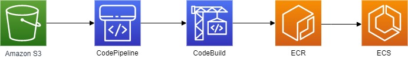

# Scaling

This solutions implements containers running on ECS instance to deliver the website to the user. 

Autoscaling groups with capacity providers has been configured so that the number of containers and hence host instances will scale accordingly with CPU utilisation. 

This means that should the traffic hitting the website increase more, instances and containers will be provisioned to ensure that the users can access the site.

# Deployment

In this solution a custom image stored in DockerHub was used for the task definition.  

In production a deployment pipeline can be set up using CI tools such as Jenkins or CodePipeline. 

A diagram of a possible pipeline is shown below:

The file buildspec.yml file along with all the application files will be uploaded to s3. 

When a new file is uploaded this will trigger a CodeBuild project to start in CodePipeline. 

The CodeBuild project will build a new docker image and store it in ECR. The image will then be referenced in the task definition in ECS.
